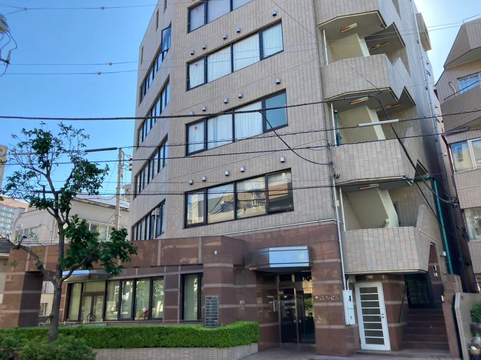

# 短期訓練への参加

## 短期訓練参加希望の方へ

東京全時間訓練は、開講期間中はいつでも体験入学を受け入れています。定まった日程はなく、いつでも、何日でも参加することができます。学生でも、在職でも、休みの日を利用して参加することができます。訓練生と同じクラスに出席し、同じ奉仕にあずかり、福音チームにも割り当てられます。

---

## 申込方法

申し込みは下記の書類を印刷した後、記入して地元の責任者または長老にお渡しください。JGWに送る用に手配してください。JGWへは、 [ftttk@jgw.or.jp](mailto:ftttk@jgw.or.jp) にメールにて、あるいは郵送にて提出するようにしてください。

[短期訓練参加の申込み用紙をダウンロード](ftttk_short_term_application.pdf)